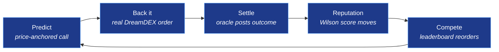
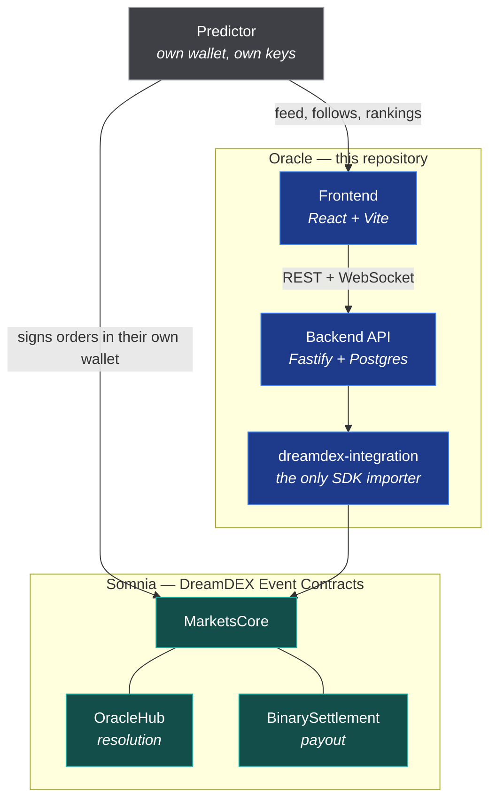

<div align="center">

# Oracle

**Social prediction + trading network for DreamDEX Event Contracts.**

*A prediction is not a post. It is a price-anchored call on a real binary market —
and backing it places a real on-chain order.*

[](https://github.com/midexol/Oracle/actions/workflows/ci.yml)


[Architecture](docs/architecture.md) ·
[Data model](docs/data-model.md) ·
[Reputation](docs/reputation.md) ·
[API](docs/api.md) ·
[Decisions](docs/README.md#decision-records)

</div>

---

## The loop

Users discover predictions, back them with real trades, compete for reputation,
and build a verifiable track record. Every arrow is implemented.



The edge that matters: every backed trade carries the predictor who caused it,
so **originated DreamDEX volume is measurable per user**. Oracle drives volume
to the exchange rather than merely displaying it.

## How it fits together



**Oracle deploys no smart contract of its own.** Custody, matching, resolution
and payout all live in DreamDEX's already-audited contracts — so everything that
touches money stays non-custodial and independently verifiable. The social layer
is Oracle's own bookkeeping, and that boundary is drawn on purpose:
[ADR-0001](docs/adr/0001-no-custom-smart-contract.md).

## Quick start

Runs end to end with **no testnet funds and no network** — `DREAMDEX_MODE=mock`
is a real simulator (pricing, order book, async fills, settlement), not a stub.

```bash
npm install

# The backend needs a Postgres URL and a JWT secret.
cp packages/oracle-backend/.env.example packages/oracle-backend/.env

npm run db:migrate
npm run db:seed        # optional: a populated feed and leaderboard
npm run dev            # API on http://localhost:4000
```

```bash
curl localhost:4000/health
```

Point it at the real exchange with `DREAMDEX_MODE=live`. Order placement
defaults to `DRY_RUN=true`; set `DRY_RUN=false` to send real transactions.

## Packages

An npm workspaces monorepo. One hard rule: **nothing outside
`dreamdex-integration` imports the Somnia SDK.**

| Package | What it owns |
|---|---|
| [`packages/dreamdex-integration`](packages/dreamdex-integration) | The only place that talks to `@somnia-chain/markets-sdk`: markets, order book, order placement, fills, settlement, redemption |
| [`packages/oracle-backend`](packages/oracle-backend) | REST + WebSocket API, Postgres schema, settlement pipeline, and the reputation / leaderboard engine |
| [`packages/frontend`](packages/frontend) | The UI — feed, market, prediction detail, profiles, battles, rankings |

## Commands

Run from the repo root; each delegates to the right workspace.

| Command | Does |
|---|---|
| `npm run dev` | Backend in watch mode |
| `npm run build` | Build every package |
| `npm run typecheck` | Typecheck every package |
| `npm test` | Unit tests across all packages |
| `npm run test:integration` | Backend tests against a real Postgres (boots a throwaway one automatically) |
| `npm run smoke` | Boot the real server and assert the frontend-facing API contract over HTTP |
| `npm run db:migrate` | Apply database migrations |
| `npm run db:seed` | Seed demo predictors, markets and history |

CI runs typecheck + build + unit tests, the integration suite **against a real
Postgres 16**, the HTTP smoke test, and a Docker image build — on every push and
pull request.

## Documentation

| | |
|---|---|
| **[Architecture](docs/architecture.md)** | System context, components, the trade path, the settlement pipeline, state machines, and the correctness properties the design is built around |
| **[Data model](docs/data-model.md)** | ERD and table reference — what is source of truth and what is rebuildable cache |
| **[Reputation](docs/reputation.md)** | Why the score is a Wilson lower bound rather than raw accuracy, with worked examples |
| **[API reference](docs/api.md)** | Endpoints, the wallet auth flow, error envelope, rate limits, realtime channels |
| **[Decision records](docs/README.md#decision-records)** | The two architectural calls that shape everything else |

## Network

Somnia Shannon testnet, chain `50312`. Testnet collateral (tUSDC) is 6 decimals
and mainnet (USDso) is 18 — decimals are always read from the token, never
hard-coded.
