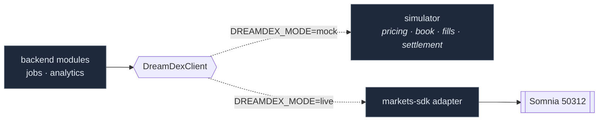

# ADR-0002 — One exchange boundary, two implementations

**Status:** accepted
**Scope:** integration architecture, testability

## Context

Oracle is built on an exchange it does not control, on a testnet, during a
hackathon. Three things follow from that:

1. The SDK surface moves. `VENUE_ID` changed three times in DreamDEX's first
   week; the question wording on markets has changed more than once.
2. Testnet is not always available, and testnet funds are not always in hand.
3. The interesting parts of Oracle — the settlement pipeline, the reputation
   engine, attribution — are downstream of the exchange. If they can only be
   exercised when the testnet is up, they mostly do not get exercised.

## Decision

**Every call to the exchange goes through one interface**,
[`DreamDexClient`](../../packages/oracle-backend/src/dreamdex/types.ts), and
nothing else in the codebase imports `@somnia-chain/markets-sdk`. Two
implementations sit behind it, selected by `DREAMDEX_MODE`:

- **`mock`** — an in-process simulator.
- **`live`** — an adapter over the real SDK against Somnia Shannon (`50312`).

All raw SDK usage is confined to
[`packages/dreamdex-integration`](../../packages/dreamdex-integration), which is
the only package that may import it.

## The mock is a simulator, not a stub

This is the part that matters. A stub returns canned values and proves nothing.
The mock implements:

- rolling Event Contract series across assets and durations,
- binary option pricing that converges toward 1c/99c as expiry approaches,
- an order book,
- **asynchronous** fills, delivered later as simulated on-chain `OrderFilled`
  events rather than returned inline,
- settlement, including voids.

That asynchrony is deliberate. A synchronous stub would let the code get away
with assuming a fill is immediate — exactly the assumption that breaks against
a real chain. Because the mock defers fills, the reconciler, the idempotency
path and the PENDING-repair logic are all genuinely exercised offline.

## Consequences

**Good.**

- The entire product — predictions, orders, fills, settlement, reputation,
  leaderboards — runs end to end with no network access and no testnet funds.
  A judge or a new contributor gets a working system from `npm install`.
- CI can run the full settlement and reputation pipeline against a real
  Postgres on every push, because the exchange half is deterministic.
- When the SDK shifts, exactly one adapter changes. Nothing downstream moves.

**Costs.**

- The mock is a second implementation to keep honest. It is held to the same
  interface and the same test suite, but a behaviour the real exchange has and
  the simulator does not is a bug that only appears live.
- `live` mode still needs manual verification against real markets for the
  known unknowns below.

## Known unknowns — verify against live data, do not assume

- **`VENUE_ID`** has changed several times. Read it off a live market row.
- **YES == UP** is assumed, since the question is framed as "will $ASSET finish
  UP?", but is not yet confirmed against a real market's `question` field.
- **Collateral decimals** differ by network. Read `decimals()`; `redeem.ts`
  takes it as an explicit argument for this reason.

## Signer model

Market data is read with a **signer-less** exchange instance. Order placement
and redemption need a signer, and that signer is the **user's own
`walletClient` in the browser** — never a backend-held key. A backend private
key would make Oracle custodial, which [ADR-0001](0001-no-custom-smart-contract.md)
rules out. `DRY_RUN=true` is the default; set it to `false` to send real
transactions.
