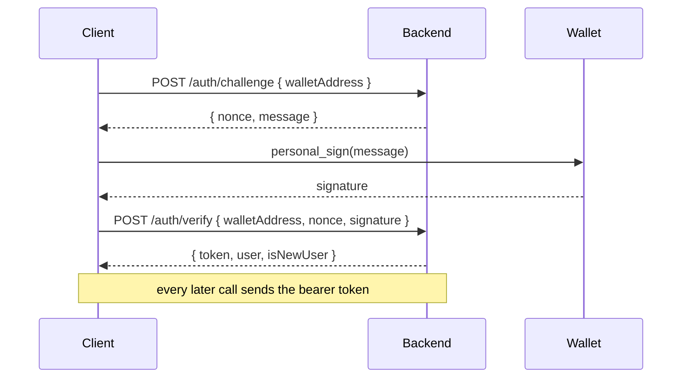

# API reference

Base URL: `http://localhost:4000` in development.

There are **two HTTP surfaces plus a WebSocket**, deliberately:

| Surface | Prefix | Envelope | For |
|---|---|---|---|
| Primary | `/api/v1` | `{ ...payload }`, errors nested under `error` | New clients |
| Compat | `/api` | `{ data }`, errors also flattened to top-level `message` | The existing frontend, which was written against the retired `oracle-analytics` contract |
| Realtime | `GET /ws` | JSON frames | Live feed, market and leaderboard updates |

The compat surface exists so the frontend never has to reach across to the other
one; it is a thin re-envelope over the same services, not a second implementation.

---

## Conventions

**Auth** is wallet-based, two steps, no password:



Nonces are single-use and expiring — a consumed one cannot be replayed.

**Errors** all share one shape on `/api/v1`. Handlers throw; nothing builds an
error response by hand.

```json
{ "error": { "code": "BAD_REQUEST", "message": "Invalid request", "details": [] } }
```

| Code | HTTP |
|---|---|
| `BAD_REQUEST` | 400 |
| `UNAUTHORIZED` | 401 |
| `FORBIDDEN` | 403 |
| `NOT_FOUND` | 404 |
| `CONFLICT` | 409 — includes Postgres unique violations |
| `RATE_LIMITED` | 429 |

**Rate limits** default to 300/min per IP, narrowed on the routes that touch a
wallet or create rows: `POST /trades` 30/min, `POST /predictions` 60/min,
`POST /auth/challenge` 20/min. `trustProxy` is on, so hosts behind a proxy still
rate-limit per client rather than globally.

**Idempotency**: send an `Idempotency-Key` header on `POST /trades`. Keys are
namespaced per user, so replaying a request returns the original trade instead
of placing a second funded order.

---

## `GET /health`

Liveness plus the two dependencies that matter. Returns 503 when degraded.

```json
{
  "status": "ok",
  "database": "up",
  "dreamdex": { "mode": "mock", "connected": true },
  "uptimeSeconds": 412
}
```

---

## `/api/v1` — primary surface

### Auth

| Method | Path | Auth | Purpose |
|---|---|---|---|
| `POST` | `/auth/challenge` | — | Returns the exact text the wallet must sign |
| `POST` | `/auth/verify` | — | Verifies the signature, issues a JWT |
| `GET` | `/auth/me` | **required** | Current identity and stats |

### Markets

| Method | Path | Auth | Purpose |
|---|---|---|---|
| `GET` | `/markets` | — | Live Event Contracts, filterable by asset and duration |
| `GET` | `/markets/:id` | — | Detail: prices, order book, tape, price history |

### Predictions

| Method | Path | Auth | Purpose |
|---|---|---|---|
| `GET` | `/feed` | optional | The social feed. With a token, personalised |
| `POST` | `/predictions` | **required** | Make a price-anchored call |
| `GET` | `/predictions/:id` | — | One prediction with its market and backers |
| `GET` | `/predictions/:id/receipt` | — | The settlement receipt: outcome, entry price, result |

### Trades

| Method | Path | Auth | Purpose |
|---|---|---|---|
| `POST` | `/trades` | **required** | Back a prediction, or trade a market directly |
| `GET` | `/trades/me` | **required** | Own trade history with realised PnL |

`POST /trades` takes either `backedPredictionId` (which determines market and
side) or `marketId` + `side`, and sizes from either `quantity` (contracts) or
`amountUsd` (spend, as the UI does).

### Users and social

| Method | Path | Auth | Purpose |
|---|---|---|---|
| `GET` | `/users/:handle` | optional | Profile: stats, segments, recent calls |
| `GET` | `/users/:handle/influence` | — | Volume originated, backers |
| `GET` | `/users/:id/followers` | — | Followers |
| `GET` | `/users/:id/following` | — | Following |
| `POST` | `/users/:id/follow` | **required** | Follow |
| `DELETE` | `/users/:id/follow` | **required** | Unfollow |
| `PATCH` | `/users/me` | **required** | Update username, avatar, bio |

### Leaderboards

| Method | Path | Auth | Purpose |
|---|---|---|---|
| `GET` | `/leaderboard` | — | Ranked by score; filterable by asset and duration |
| `GET` | `/leaderboard/influence` | — | Ranked by originated DreamDEX volume |
| `GET` | `/leaderboard/me` | **required** | Own rank |
| `GET` | `/leaderboard/me/progress` | **required** | "N correct calls from the top 10" |

### Battles

| Method | Path | Auth | Purpose |
|---|---|---|---|
| `GET` | `/battles` | — | Head-to-head calls on the same market |
| `GET` | `/battles/:id` | — | One battle with both sides |
| `GET` | `/battles/candidates` | — | Opposing predictions eligible to be paired |

---

## `/api` — compat surface

Same services, `{ data }` envelope.

| Method | Path | Notes |
|---|---|---|
| `POST` | `/auth/challenge`, `/auth/verify` | Mirrored sign-in |
| `POST` | `/predictions` | Auth **optional but honoured** — see below |
| `GET` | `/leaderboard` | |
| `GET` | `/users/:wallet/profile` | |
| `GET` | `/users/:wallet/score-breakdown` | Every input to the score, so a user can audit their own number |
| `GET` | `/predictions/:id/context` | |
| `GET` | `/stats/attribution` | Volume Oracle originated for DreamDEX |

On `POST /api/predictions`, authentication is optional-but-honoured so the
surface could be secured without breaking a client that had not implemented
sign-in yet:

- **With a token**, the token's wallet is authoritative. A body claiming a
  different wallet is *refused*, not silently overridden — posting a call under
  someone else's name is the exact thing being prevented.
- **Without one**, the body's wallet is trusted only where unsigned writes are
  permitted, which is off in production by default. It cannot ship open by
  accident.

---

## `GET /ws` — realtime

Subscribe to channels; the hub fans out pipeline events as they land.

| Event | Fires when |
|---|---|
| `market.opened` | A new Event Contract is mirrored |
| `market.quote` | Price ticks |
| `trade.filled` | An order fills on-chain |
| `market.settled` | The oracle posts an outcome |
| `leaderboard.updated` | Reputation is recomputed after a settlement |

---

## Verifying the contract

The CI smoke test (`npm run smoke`) migrates, seeds, boots the real server over
HTTP and asserts the exact field names and scales the frontend reads — including
signer authentication and locked-write behaviour. It catches routing, envelope
and serialisation breakage that service-level tests cannot see.
