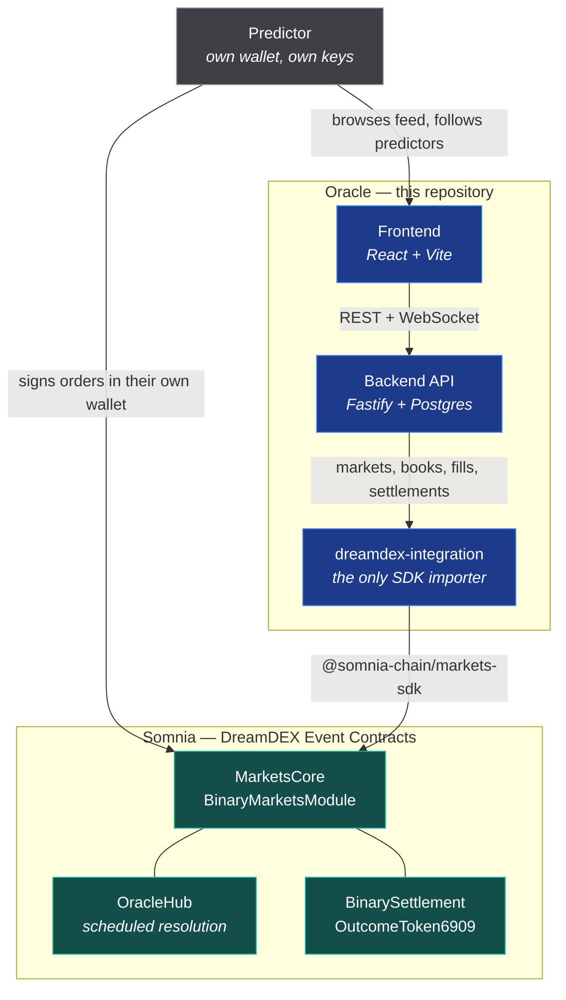
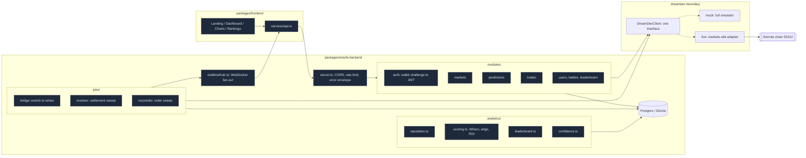
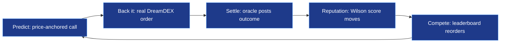
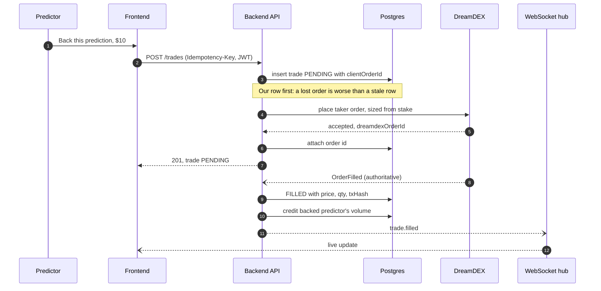
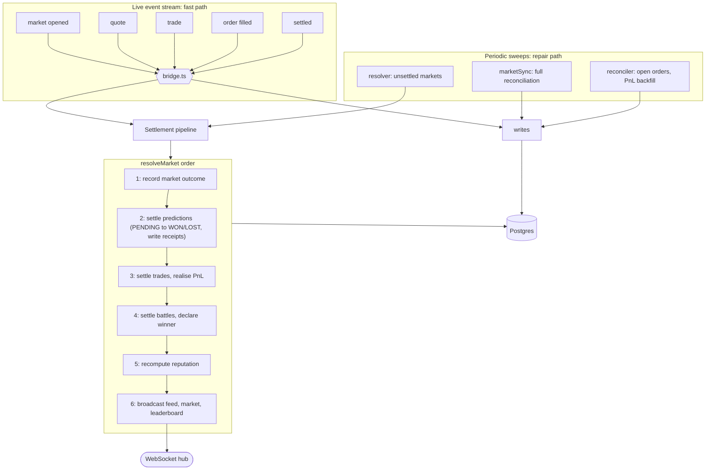
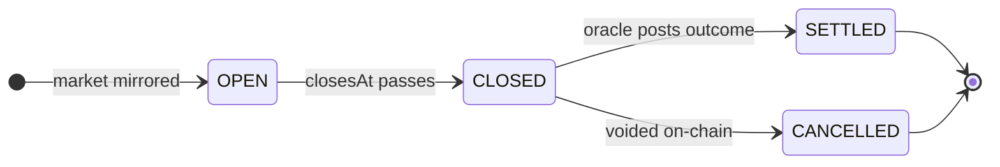
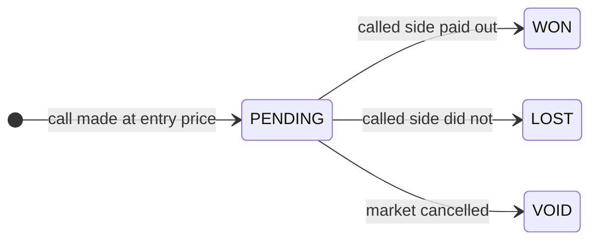
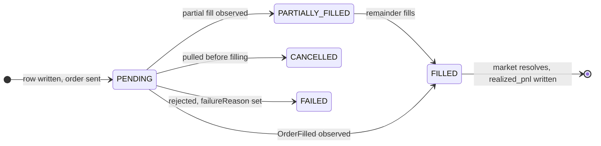
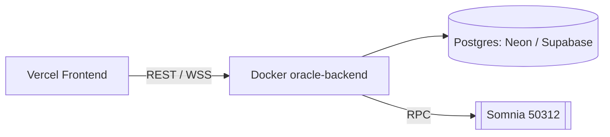

# Oracle — Architecture

> Oracle is a social prediction network layered on **DreamDEX Event Contracts**.
> A prediction is not a post: it is a price-anchored call on a real binary
> market, and backing it places a real on-chain order.

- [1. System context](#1-system-context)
- [2. Component architecture](#2-component-architecture)
- [3. The core loop](#3-the-core-loop)
- [4. Backing a prediction, end to end](#4-backing-a-prediction-end-to-end)
- [5. Ingestion and the settlement pipeline](#5-ingestion-and-the-settlement-pipeline)
- [6. State machines](#6-state-machines)
- [7. Correctness properties](#7-correctness-properties)
- [8. Deployment](#8-deployment)

---

## 1. System context

Oracle deploys **no smart contract of its own**. Custody, matching, oracle
resolution and payout all live in DreamDEX's already-audited contracts on
Somnia. Oracle reads those contracts, mirrors what it sees, and adds the
social layer on top — see [ADR-0001](adr/0001-no-custom-smart-contract.md).

**The trust boundary is the important part.** Money and outcomes are on-chain
and independently verifiable. Reputation, leaderboards and streaks are Oracle's
own bookkeeping, derived from observed on-chain activity — trustworthy only to
the extent Oracle's database is, which is a deliberate MVP tradeoff.

| Concern | Owner | Verifiable on-chain |
|---|---|---|
| Custody of funds | User's wallet | Yes |
| Order matching | `MarketsCore` | Yes |
| Outcome resolution | `OracleHub` | Yes |
| Payout math | `BinarySettlement` | Yes |
| Reputation, score, streaks | Oracle backend | No — derived |
| Feed, follows, battles | Oracle backend | No |

---

## 2. Component architecture

An npm-workspaces monorepo with one hard rule: **nothing outside
`dreamdex-integration` imports the Somnia SDK.**

| Package | Owns | Entry point |
|---|---|---|
| [`@signal/dreamdex-integration`](../packages/dreamdex-integration) | The only package that imports `@somnia-chain/markets-sdk`. Exposes `DreamDexClient`, order types, settlement helpers, and a standalone CLI | `src/index.ts` |
| [`@signal/oracle-backend`](../packages/oracle-backend) | API, Postgres schema, settlement pipeline, reputation engine | `src/index.ts` |
| [`@signal/frontend`](../packages/frontend) | React UI (Vite) | `src/App.jsx` |

---

## 3. The core loop and originated volume

Everything in the product exists to close this loop. Break any arrow and
Oracle is just a feed.

The attribution edge is what makes Oracle valuable to the exchange: every
backed trade carries `backed_prediction_id` and `backed_user_id`, so
originated volume is measurable per predictor (`GET /stats/attribution`).

---

## 4. Backing a prediction, end to end

Note the write order: **Oracle's own row lands before the exchange call.**
Crashing after the insert leaves a `PENDING` row the reconciler can repair;
crashing after the order would leave a funded on-chain order Oracle has no
record of, which is not recoverable.

If that `OrderFilled` event is ever missed — a disconnect, a restart, a dropped
message — the **reconciler** sweep catches the order against the exchange, so
no trade sits `PENDING` forever and no originated volume goes uncounted.

---

## 5. Ingestion and the settlement pipeline

Every exchange event enters the system at exactly one place
([`jobs/bridge.ts`](../packages/oracle-backend/src/jobs/bridge.ts)), which keeps
the ingestion rules readable in one file.

Reputation is recomputed **last** because it reads rows the earlier steps
write. Running it first — or concurrently — would produce stats for a
settlement that had not finished landing.

---

## 6. State machines

**Market**

**Prediction** — `VOID` never touches a score. An exchange-side cancellation
must not damage anyone's record.

**Trade**

---

## 7. Correctness properties

These are the invariants the design is actually built around.

| Property | How it is held |
|---|---|
| **No lost order** | The trade row is written before the exchange call; the reconciler repairs any `PENDING` |
| **No double-count** | Every pipeline step no-ops on already-settled rows, so `resolveMarket` is idempotent |
| **Replay-safe** | A duplicated settlement event, a reconnect replaying history, and the sweep all converge to the same state |
| **Correct on either path alone** | The system is correct on the event stream alone *and* on the sweeps alone, so it survives losing either |
| **Rebuildable stats** | `user_stats` is a cache; `recomputeUserStats` rebuilds every number from `predictions` |
| **Auditable score** | Scoring is pure functions of settled predictions, so any number in the UI can be re-derived |
| **Idempotent requests** | `Idempotency-Key` is namespaced per user; a replay returns the original trade, never a second funded order |
| **Non-custodial** | The backend holds no user key. Signing happens in the user's wallet |

---

## 8. Deployment

CI ([`.github/workflows/ci.yml`](../.github/workflows/ci.yml)) runs three jobs on
every push and pull request:

1. **Typecheck, build and unit tests** across all workspaces.
2. **Integration tests against a real Postgres 16** — the hand-written SQL
   (Wilson ranking, leaderboard aggregates, PnL backfill) cannot fail at
   compile time, so running it for real is not optional. Followed by an HTTP
   **smoke test** that boots the real server and asserts the exact field names
   and scales the frontend reads.
3. **Docker image build** for the backend.

---

### Further reading

- [Data model](data-model.md) — ERD and table reference
- [Reputation](reputation.md) — the scoring math, with worked examples
- [API reference](api.md) — every endpoint
- [ADR-0001](adr/0001-no-custom-smart-contract.md) — why Oracle ships no contract
- [ADR-0002](adr/0002-single-dreamdex-boundary.md) — one exchange boundary, two implementations
