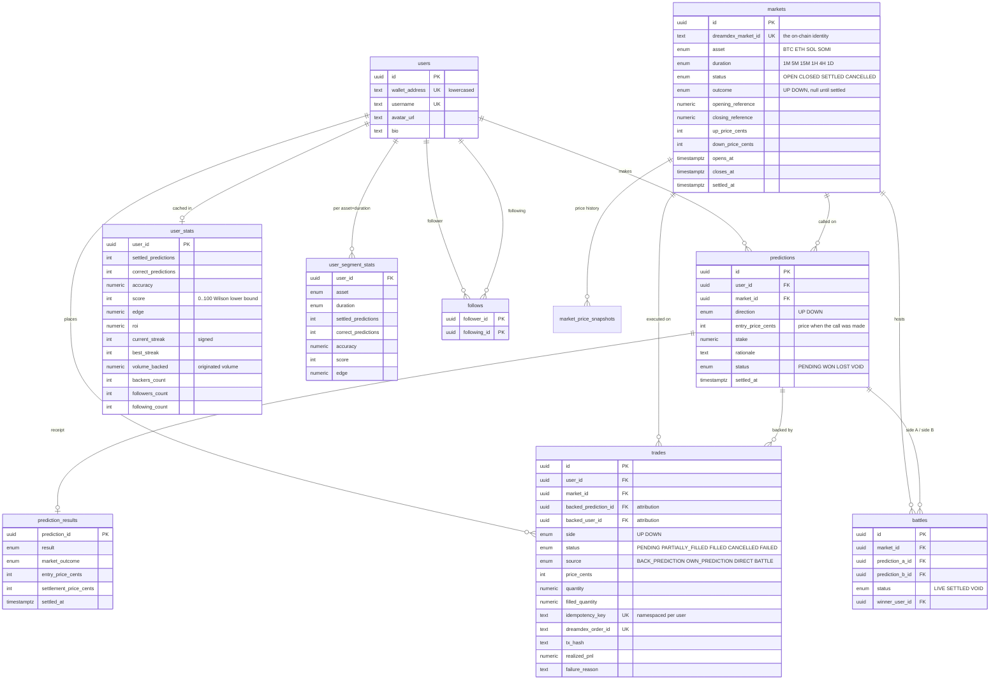

# Data model

Postgres, accessed through [Drizzle](https://orm.drizzle.team/). Schema lives in
[`packages/oracle-backend/src/db/schema/`](../packages/oracle-backend/src/db/schema).

Eleven tables in three groups:

| Group | Tables | Rebuildable? |
|---|---|---|
| **Identity** | `users`, `auth_nonces`, `follows` | No — source of truth |
| **Market truth** | `markets`, `market_price_snapshots`, `predictions`, `prediction_results`, `trades`, `battles` | No — source of truth |
| **Derived cache** | `user_stats`, `user_segment_stats` | **Yes** — `recomputeUserStats` rebuilds every number from `predictions` |

That last row is the point: a derived table that cannot be rebuilt is a table
that will eventually be wrong and unfixable.

---

## Entity relationships



`auth_nonces` and `market_price_snapshots` are omitted above for readability:

| Table | Purpose |
|---|---|
| `auth_nonces` | One-shot wallet-login challenges. `nonce` PK, `expires_at`, `consumed_at` — a consumed nonce cannot be replayed. |
| `market_price_snapshots` | Time series of `up_price_cents` / `down_price_cents` per market, written at most every 5s, for charts. |

---

## Design notes worth knowing

**Prices are integer cents, not floats.** An Event Contract trades between 1c
and 99c and pays 100c. Cents are exact, and every scoring formula is defined on
them — there is no float rounding anywhere in the reputation path.

**`entry_price_cents` is captured on the prediction, not looked up later.** A
call made when UP was 43c is a harder, more valuable call than the same call at
85c. Storing the price at call time is what makes `edge` computable at all.

**Decimals are read, never hard-coded.** Testnet collateral (tUSDC) is 6dp;
mainnet (USDso) is 18dp. `numeric(20, 6)` on the Oracle side, with the on-chain
`decimals()` read at the boundary.

**Attribution is two columns.** `backed_prediction_id` and `backed_user_id` on
`trades` are what let Oracle answer "how much DreamDEX volume did this
predictor originate" — the metric that makes the product worth something to the
exchange rather than just to its users.

**Wallet addresses are stored lowercased** (`normalizeAddress`), so a checksummed
and non-checksummed login are the same account.

---

## Migrations

```bash
npm run db:generate   # diff the schema into a new migration
npm run db:migrate    # apply
npm run db:seed       # demo predictors with real settled history
```

The seed is not decorative — it produces settled predictions with real entry
prices, so leaderboards, scores, streaks and segment stats are all populated
and the whole product is demoable immediately after a clean install.
