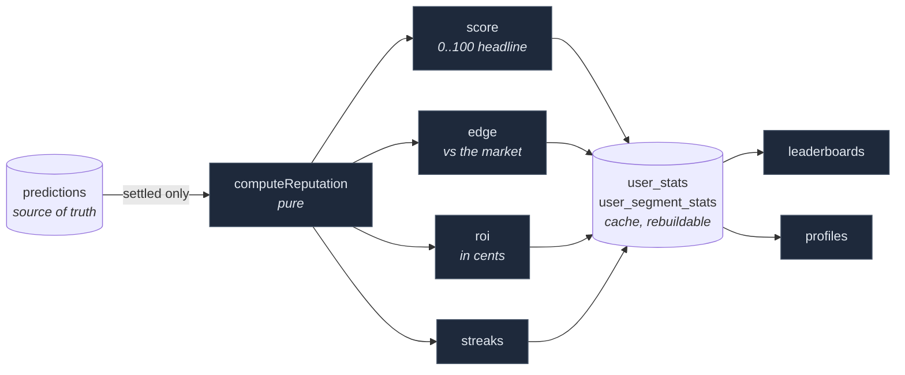

# Reputation

The scoring model is in
[`analytics/scoring.ts`](../packages/oracle-backend/src/analytics/scoring.ts) and
is **entirely pure functions of settled predictions**. Every number shown in
the product can be re-derived from raw prediction history — which is the only
reason a track record is worth trading on.



Only `WON` and `LOST` predictions are scored. `PENDING` calls never move a
score, and `VOID` ones are excluded entirely — an exchange-side cancellation
must not damage anyone's record.

---

## The headline score: Wilson lower bound

Raw accuracy makes a leaderboard useless. Someone who called one market and got
it right sits at 100%, above a predictor who is 47-for-63. So the score does not
ask "what is their hit rate" — it asks:

> **Given this record, what is the pessimistic estimate of their true hit rate?**

That is the lower bound of the [Wilson score interval](https://en.wikipedia.org/wiki/Binomial_proportion_confidence_interval#Wilson_score_interval)
at 95% confidence (`z = 1.96`):

```
              p̂ + z²/2n − z·√( (p̂(1−p̂) + z²/4n) / n )
score = 100 · ────────────────────────────────────────
                            1 + z²/n
```

Evidence, not luck, is what climbs the board:

| Record | Raw accuracy | **Score** |
|---|---|---|
| 1 / 1 | 100% | **21** |
| 3 / 3 | 100% | **44** |
| 5 / 5 | 100% | **57** |
| 7 / 10 | 70% | **40** |
| 15 / 20 | 75% | **53** |
| 30 / 40 | 75% | **60** |
| 47 / 63 | 75% | **63** |
| 70 / 100 | 70% | **60** |
| 90 / 100 | 90% | **83** |

A perfect 1-for-1 scores 21. A 47-for-63 grinder scores 63. This is a standard
statistic, not a bespoke formula — which is what keeps the score explainable in
one sentence to a user.

---

## Edge: difficulty adjustment

An Event Contract priced at 43c pays 100c, so the market is saying "43%".
Calling UP at 43c and being right is genuinely harder than calling UP at 85c.

```
impliedProbability = entryPriceCents / 100
edge = mean( outcome − impliedProbability )        outcome ∈ {0, 1}
```

Positive edge means the predictor beats the market's own pricing. It is
computed and stored from day one but presented as a **secondary** stat — the
headline number stays the one a user can understand instantly.

## ROI: what the edge was worth

```
contractPnl(won)  = won ? (100 − entry) : −entry     in cents
roi               = 100 · Σ pnl / Σ entry
```

**Worked example** — five calls, all entered at 43c, three correct:

| | |
|---|---|
| Score | `wilson(3, 5)` → **23** |
| Accuracy | 60% |
| Edge | `0.6 − 0.43` → **+0.17** — beating the market by 17 points |
| ROI | `(3×57 − 2×43) / 215` → **+39.5%** |

## Streaks

`currentStreak` is **signed**, so one field drives both "3 in a row" and "cold,
2 straight misses" in the UI. `bestStreak` only ever tracks wins. Both are
computed over settlement order, not creation order.

---

## Segments

The same metrics are computed per `(asset, duration)` pair into
`user_segment_stats` — so "top BTC 1H predictor" is a real, separately-ranked
thing, and a predictor strong on 1-day ETH is not flattened into one global
number.

## The nudge

`callsToReachScore(correct, settled, target)` answers "how many more correct
calls to reach this score" — the cheapest way to turn a static leaderboard into
a reason to keep predicting. It powers *"you are 4 correct calls from the top
10"*, and returns `null` when the target is unreachable within the horizon.

---

## Recompute, not increment

[`reputation.ts`](../packages/oracle-backend/src/analytics/reputation.ts) does a
**full rebuild** rather than incremental counter updates. At hackathon scale
(hundreds of predictions per user) that is one indexed query, and it is immune
to the drift incremental counters accumulate when a settlement is replayed or a
market is retroactively voided.

If a user's history ever outgrows that, the fix is to move the rebuild into SQL
aggregates — not to make it incremental.

## Tests

The model is unit-tested in
[`scoring.test.ts`](../packages/oracle-backend/src/analytics/scoring.test.ts),
and the full path from settlement to leaderboard is covered against a real
Postgres in
[`analytics.integration.test.ts`](../packages/oracle-backend/src/analytics/analytics.integration.test.ts).
